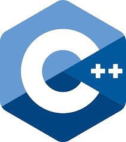

##  

 
### Hi there, I'm Ankit Kumar - aka [AnkIT]()  

	

- 🌱 I’m currently learning everything 😎
	
-  I’m looking to collaborate with other content creators
	
- 🥅 Goals: Contribute more to Open Source projects
- ⚡ Fun fact: I love to draw, play cricket & video games🎮

## Connect with me:

	
	
	
	

---

	
	    
	
	    
	    
	    
	
         
	    
	    
	
     
       
	
	
	
	
		
	

